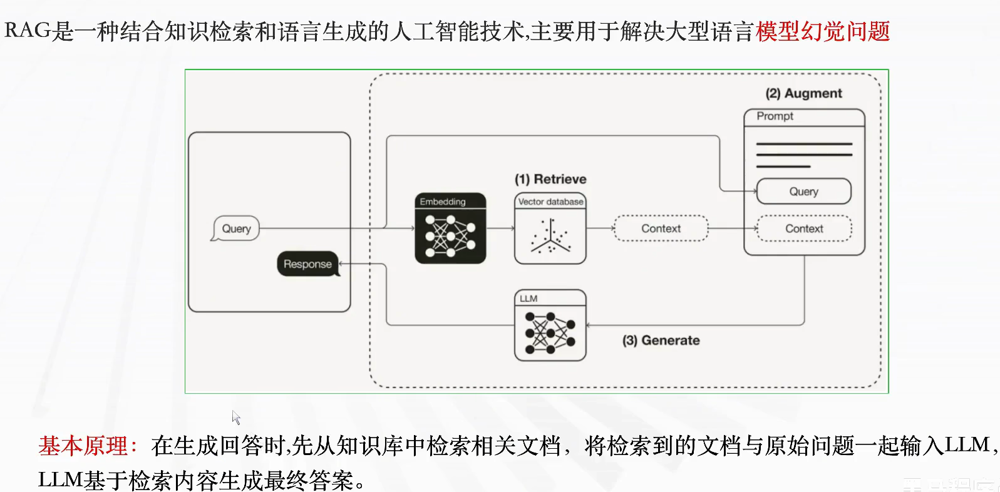
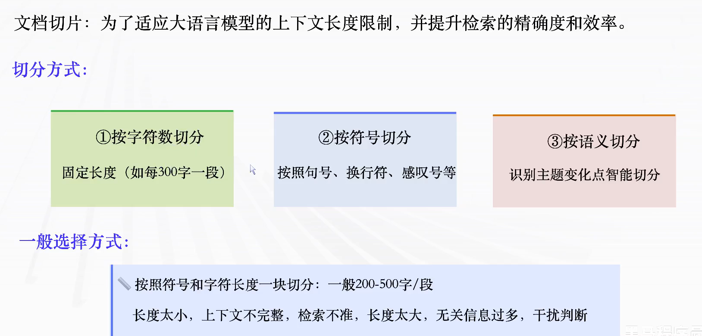
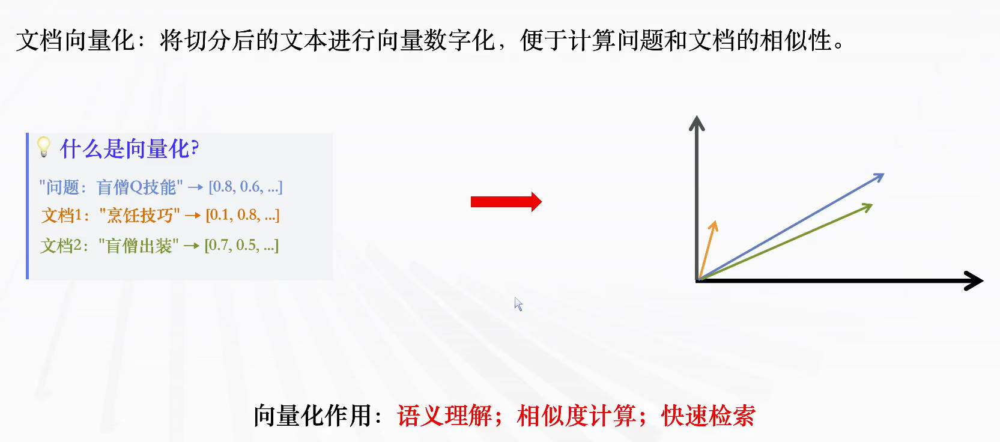
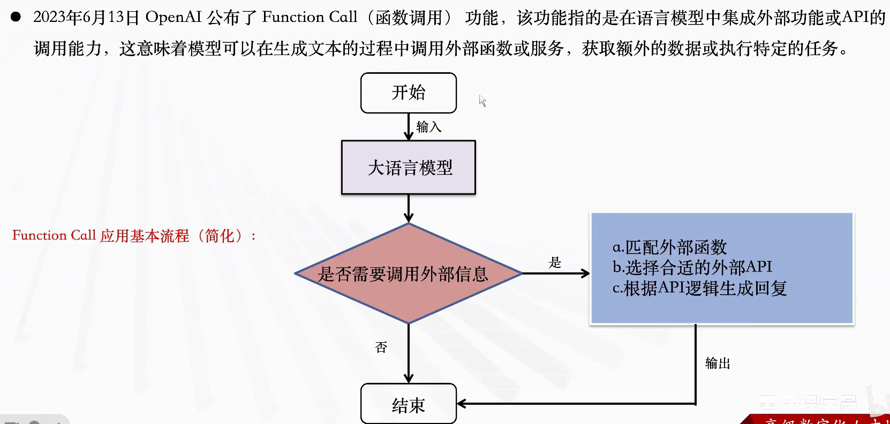
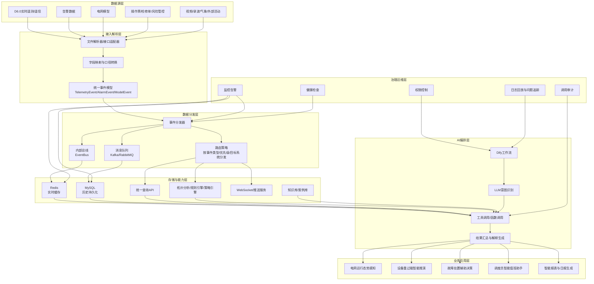

# Agent

## RAG（检索增强技术）

## Function Calling

用户请求，大模型判断是否调用函数，函数返回大模型结果，给出答案

```mermaid
flowchart TB
    subgraph S1["数据源层"]
        A1["D6.0实时遥测/遥信"]
        A2["告警数据"]
        A3["电网模型"]
        A4["操作票/检修单/风险管控"]
        A5["视频/录波/气象/外部活动"]
    end

    subgraph S2["接入解析层"]
        B1["文件解析器/接口适配器"]
        B2["字段映射与口径转换"]
        B3["统一事件模型<br/>TelemetryEvent/AlarmEvent/ModelEvent"]
    end

    subgraph S3["数据分发层"]
        C1["事件分发器"]
        C2["内部总线<br/>EventBus"]
        C3["消息队列<br/>Kafka/RabbitMQ"]
        C4["路由策略<br/>按事件类型/优先级/目标系统分发"]
    end

    subgraph S4["存储与能力层"]
        D1["Redis<br/>实时缓存"]
        D2["MySQL<br/>历史持久化"]
        D3["统一查询API"]
        D4["拓扑分析/规则引擎/策略引擎"]
        D5["WebSocket/推送服务"]
        D6["知识库/案例库"]
    end

    subgraph S5["AI编排层"]
        E1["Dify工作流"]
        E2["LLM意图识别"]
        E3["工具调用/函数调用"]
        E4["结果汇总与解释生成"]
    end

    subgraph S6["业务应用层"]
        F1["电网运行态势感知"]
        F2["设备重过载智能推演"]
        F3["故障处置辅助决策"]
        F4["调度员智能值班助手"]
        F5["智能报表与日报生成"]
    end

    subgraph S7["治理运维层"]
        G1["权限控制"]
        G2["调用审计"]
        G3["监控告警"]
        G4["健康检查"]
        G5["日志回放与问题追踪"]
    end

    A1 --> B1
    A2 --> B1
    A3 --> B1
    A4 --> B1
    A5 --> B1

    B1 --> B2
    B2 --> B3
    B3 --> C1
    C1 --> C2
    C1 --> C3
    C1 --> C4

    C2 --> D1
    C3 --> D2
    C4 --> D3
    C4 --> D4
    C4 --> D5

    D1 --> E3
    D2 --> E3
    D3 --> E3
    D4 --> E3
    D6 --> E3

    E1 --> E2
    E2 --> E3
    E3 --> E4

    E4 --> F1
    E4 --> F2
    E4 --> F3
    E4 --> F4
    E4 --> F5

    G1 --> E1
    G2 --> E3
    G3 --> C1
    G3 --> D1
    G3 --> D2
    G4 --> C1
    G5 --> E1
```

