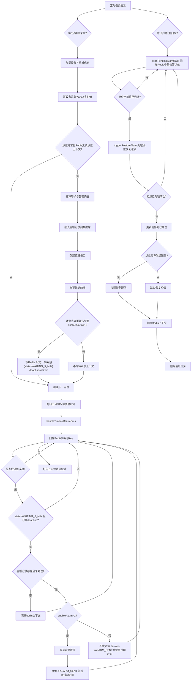
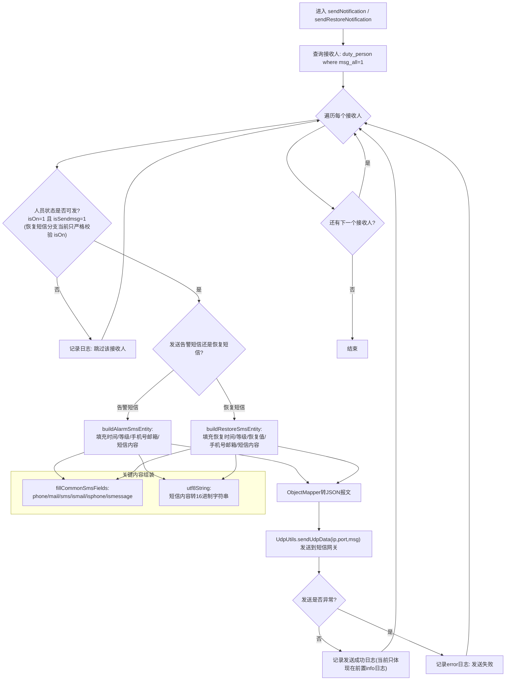

# 安徽机房

## 安徽机房功能梳理

### 能耗统计

**1. 定时采集与落库（用电统计主链）**
入口是 EnergyStatisticsTask.java (line 68)，每小时整点跑一次。流程是：先按设备类型拆两批设备（配电 54，IT 50/53）EnergyStatisticsTask.java (line 73)，月初零点先归档上月数据 EnergyStatisticsTask.java (line 80)，再并发调用服务采集 EnergyStatisticsTask.java (line 86)。

单设备采集在 ElectricityServiceImpl.java (line 265)：

- 配电取点位“组合有功总电能”，IT取两路进线累计点位 ElectricityServiceImpl.java (line 95)。
- 从 df_jk_yc 取最新点位，按点位名去重并汇总成当前累计电能快照（totalEnergy + collectTime）ElectricityServiceImpl.java (line 363)。
- 增量电量 = currentTotal - lastTotal，负值直接置 0 ElectricityServiceImpl.java (line 509)。
- 周期判断用“上次采集日期 vs 本次采集日期”计算跨天/跨周/跨月（不再依赖 hour==0）ElectricityServiceImpl.java (line 751)。
- 日序列是固定 24 槽，按采集小时写到对应索引 ElectricityServiceImpl.java (line 537)。
- 周/月序列存“当天累计值”，跨天先补槽，再回写最后一个槽位 ElectricityServiceImpl.java (line 342)。

月归档逻辑在 EnergyStatisticsTask.java (line 99)：取 df_electricity_statistics 当前 energy_monthly_kwh 求和，写入 his_rack_statistics。

**2. 用电量查询（getElectricityStatistics）**
查询入口在 ElectricityServiceImpl.java (line 196)。按机房取 df_electricity_statistics 所有设备后：

- dailyElectricity：把各设备 energy_daily_kwh 按索引求和，再裁剪到“当天 0 点到当前时刻” ElectricityServiceImpl.java (line 225)。
- weeklyElectricity：按索引求和后裁剪到“周一到前一天” ElectricityServiceImpl.java (line 228)。
- monthlyElectricity：按索引求和后裁剪到“每月1号到前一天” ElectricityServiceImpl.java (line 231)。
- 同时返回 lastMonthlyElectricity（上月序列）和 monthlyCurrentElectricity（本月累计）ElectricityServiceImpl.java (line 234)。

**3. PUE 查询（getEnergyStatistics）**
PUE 查询入口在 ElectricityServiceImpl.java (line 125)。

- 分子（总电）取设备类型 54，分母（IT电）取 50/53 ElectricityServiceImpl.java (line 137)。
- 当前 pue 用 last_total_energy_kwh 汇总计算：pue = totalLastTotal / itLastTotal ElectricityServiceImpl.java (line 155)。
- 趋势 daily/weekly/monthlyPueTrend 是先把两类设备序列按索引汇总，再逐点 total/it 计算，并按时间窗口裁剪 ElectricityServiceImpl.java (line 145) ElectricityServiceImpl.java (line 449)。

核心上，当前系统是“双口径并存”：

- 当前值（瞬时）看 last_total_energy_kwh；
- 趋势看日/周/月字符串序列。

### 数据采集-告警-短信流程

### 短信发送

## 安徽机房项目踩坑

### @JsonFormat注解在BeanUtils.copyProperties()方法中会失效

##### 核心原理：

让我们来解析一下两个工具的工作机制：

- **@JsonFormat 的工作方式**：它的功能由 Jackson 库实现。只有当您使用 `ObjectMapper`（如 `objectMapper.writeValueAsString(obj)`）将对象序列化为 JSON 字符串时，Jackson 才会去读取这个注解，并按照您指定的 `pattern`（如 `yyyy-MM-dd HH:mm:ss`）来格式化时间字段。
- **BeanUtils.copyProperties() 的工作方式**：这个方法通过 Java 反射机制工作。它会找到源对象和目标对象中**同名的属性**，然后调用属性的 `getXxx()` 方法从源对象读取值，再调用 `setXxx()` 方法将值写入目标对象。这个过程完全是内存中的字段值拷贝，**既不涉及 JSON 转换，也不会检查和解析任何 Jackson 相关的注解**。

