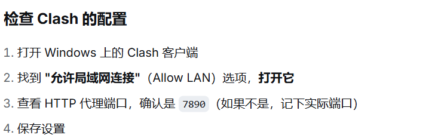

# WSL

## wsl安装

**win+R** 输入**appwiz.cpl**  进入 **程序和功能** 界面，点击 **启用或关闭 Windows 功能**

勾选：

- **适用于 Linux 的 Windows 子系统**
- **虚拟机平台 / Windows 虚拟机监控程序平台**

### 安装wsl命令

```json
wsl --install    安装wsl以及分发的liunx版本 
```

### 安装指定的ubuntu到指定文件夹

- 删除默认的ubuntu

```
wsl --unregister Ubuntu-20.04
```

- 下载指定版本的ubuntu (默认安装在C盘)

```json
wsl --install -d Ubuntu-22.04
```

- 导出tar包

```json
wsl --export Ubuntu-22.04 D:\WSL\Ubuntu-22.04\Ubuntu-22.04.tar
```

- 将 Ubuntu-22.04 tar包重新导入到`D:\WSL\Ubuntu-22.04`：

```json
wsl --import Ubuntu-22.04 D:\WSL\Ubuntu-22.04 D:\WSL\Ubuntu-22.04\Ubuntu-22.04.tar --version 2
```

### 操作命令

启动ubuntu

```json
wsl
```


## wsl访问外网

确认vpn配置  代理的端口号（根据实际情况决定）等



### 打开 ~/.bashrc 文件在 WSL 的 Ubuntu 终端中执行：

```bash
nano ~/.bashrc
```


### 添加代理刷新函数

```bash
# ===== 自定义函数：刷新 resolv.conf 和设置代理 ==
refresh_resolv() {
    # 获取当前网络中的 Windows IP
    CURRENT_WIN_IP=$(ip route show default | awk '{print $3}')
    
    # 获取 resolv.conf 中记录的 IP
    if [ -f /etc/resolv.conf ]; then
        RECORDED_IP=$(cat /etc/resolv.conf | grep nameserver | awk '{print $2; exit}')
    else
        RECORDED_IP=""
    fi
    
    # 如果两者不一致，刷新 resolv.conf
    if [ "$CURRENT_WIN_IP" != "$RECORDED_IP" ]; then
        echo "🔄 IP 已变化 ($RECORDED_IP -> $CURRENT_WIN_IP)，正在刷新 resolv.conf..."
        sudo rm /etc/resolv.conf
        sudo sh -c "echo \"nameserver $CURRENT_WIN_IP\" > /etc/resolv.conf"
        echo "✓ resolv.conf 已更新"
    fi
}

# 函数2：设置代理
set_proxy() {
    WIN_IP=$(cat /etc/resolv.conf 2>/dev/null | grep nameserver | awk '{print $2; exit}')
    if [ -n "$WIN_IP" ]; then
        export http_proxy="http://$WIN_IP:7890"
        export https_proxy="http://$WIN_IP:7890"
        echo "✓ 代理已设置: $http_proxy"
    else
        echo "⚠️ 无法获取 Windows IP，代理未设置。"
    fi
}

# 函数3：取消代理
unset_proxy() {
    unset http_proxy https_proxy
    echo "✓ 代理已取消"
}

# 每次打开终端自动执行
refresh_resolv
set_proxy
```

### 重新加载 ~/.bashrc

```bash
source ~/.bashfrc
```

### 打开wsl，测试

```
# 测试代理函数（示例2）
set_proxy      # 设置代理
unset_proxy    # 取消代理
refresh_resolv # 手动刷新 IP
```